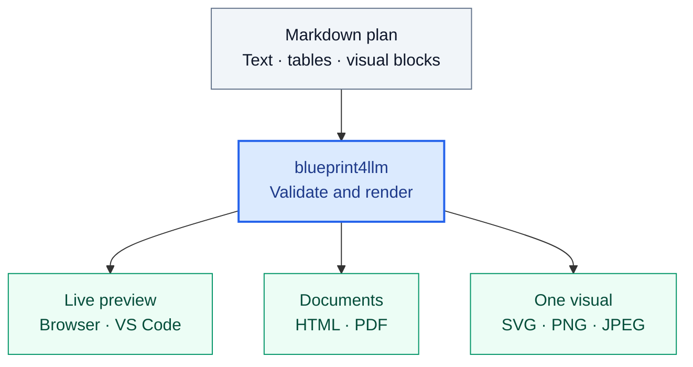

# Rendering workflow

```mermaid
flowchart TB
    Source["Markdown plan\nText · tables · visual blocks"]
    CLI["blueprint4llm\nValidate and render"]
    Preview["Live preview\nBrowser · VS Code"]
    Documents["Documents\nHTML · PDF"]
    Visual["One visual\nSVG · PNG · JPEG"]

    Source --> CLI
    CLI --> Preview
    CLI --> Documents
    CLI --> Visual

    classDef source fill:#f1f5f9,stroke:#64748b,color:#0f172a
    classDef engine fill:#dbeafe,stroke:#2563eb,color:#1e3a8a,stroke-width:2px
    classDef output fill:#ecfdf5,stroke:#059669,color:#064e3b
    class Source source
    class CLI engine
    class Preview,Documents,Visual output
```
