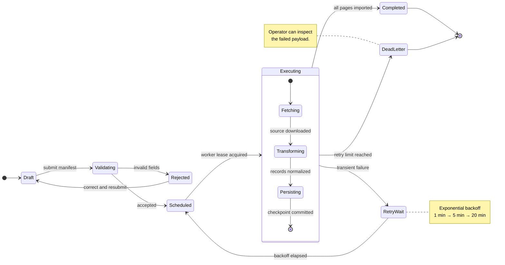

# Resilient import lifecycle

This state machine shows the full job lifecycle, including edits after validation errors,
worker retries, nested execution steps, and a terminal dead-letter state.

```mermaid
stateDiagram-v2
    direction LR

    [*] --> Draft
    Draft --> Validating: submit manifest
    Validating --> Rejected: invalid fields
    Rejected --> Draft: correct and resubmit
    Validating --> Scheduled: accepted
    Scheduled --> Executing: worker lease acquired

    state Executing {
        [*] --> Fetching
        Fetching --> Transforming: source downloaded
        Transforming --> Persisting: records normalized
        Persisting --> [*]: checkpoint committed
    }

    Executing --> RetryWait: transient failure
    RetryWait --> Scheduled: backoff elapsed
    Executing --> Completed: all pages imported
    Executing --> DeadLetter: retry limit reached
    Completed --> [*]
    DeadLetter --> [*]

    note right of RetryWait
      Exponential backoff
      1 min → 5 min → 20 min
    end note

    note left of DeadLetter
      Operator can inspect
      the failed payload.
    end note
```
